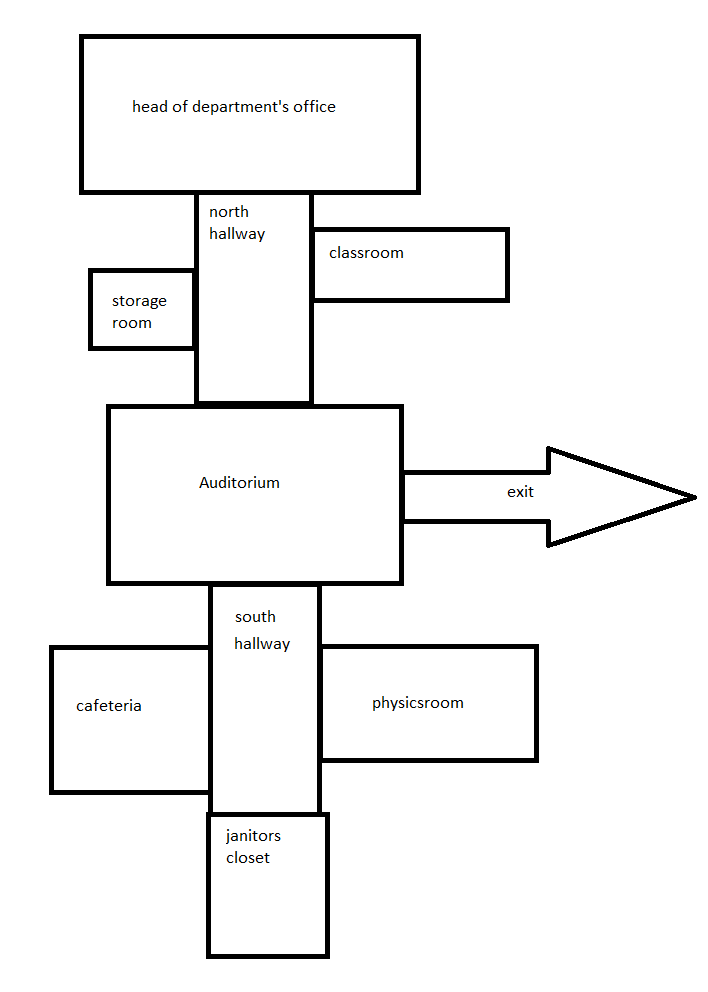

# HTL Escape
You wake up in a dark classroom of HTL Leonding. You don’t know how
you ended up here, but you do know that you need to get out of there as
soon as possible, because you don’t want to get caught by the janitor in
the morning. You also get bonus points if you manage to pilfer a dropout
form. But be careful! The sun is coming up soon and you might not be
alone! For convenience’s sake we included a rough map of the building,
but beware: It might not be complete. We also utilize incomplete and
hidden objects, so keep an eye out!

## Roomplan: 

# Authors: 
[Lawrence Federsel](https://www.htl-leonding.at/)  
[Lorenz Horvath](https://www.htl-leonding.at/)